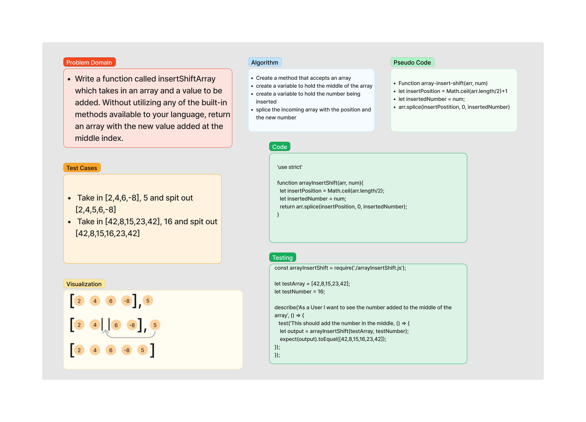

# Reverse an array

Write a function called insertShiftArray which takes in an array and a value to be added. Without utilizing any of the built-in methods available to your language, return an array with the new value added at the middle index.

[Link to Challenge](https://canvas.instructure.com/courses/6390937/assignments/36196486)

## Whiteboard Process

## Approach & Efficiency

I thought the easiest way to tackle this problem is to use arr.length/2 to find the middle and then use Math.ceil to round it up for odd number arrays. I saved that to a variable as well as the incoming number. Then I used splice on the incoming array with the /2 var as the insert point and the num variable as what number is being saved.

## Solution

[The Replit](https://replit.com/@goodpudding/array-insert-shift#index.js)
