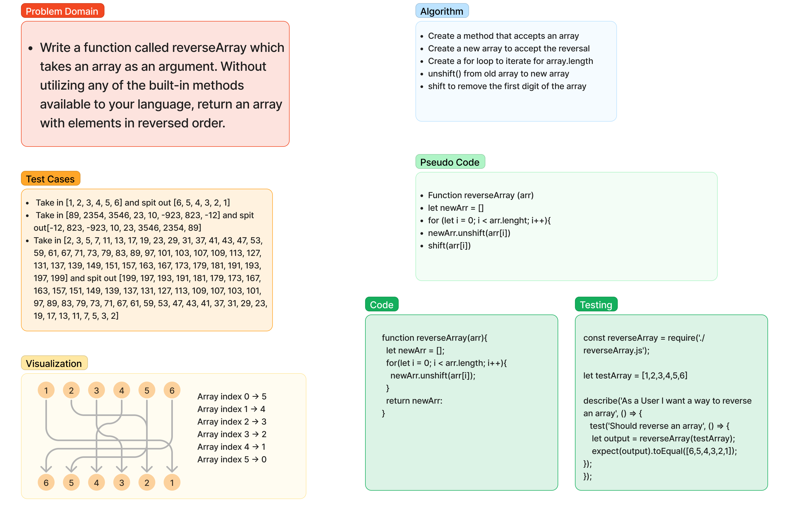

# Reverse an array
Write a function called reverseArray which takes an array as an argument. Without utilizing any of the built-in methods available to your language, return an array with elements in reversed order.

[Link to Challenge](https://canvas.instructure.com/courses/6390937/assignments/36196485)

## Whiteboard Process

## Approach & Efficiency

I decided to use unshift and a for loop, because unshift takes the from the first array and then adds it to the front of the second array and then I just return the second array.

## Solution

[The Replit](https://replit.com/@goodpudding/reverseArray)
