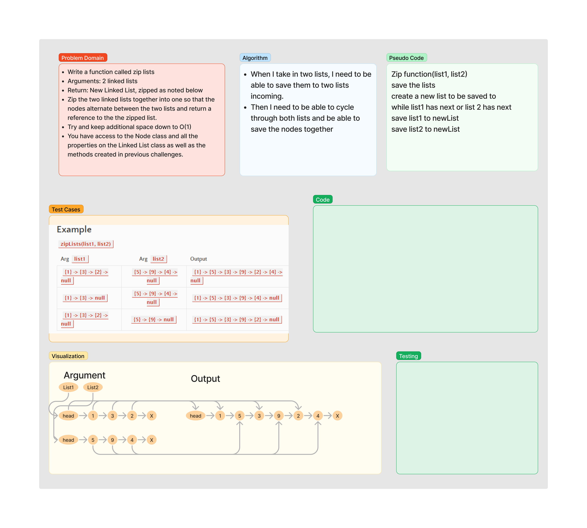
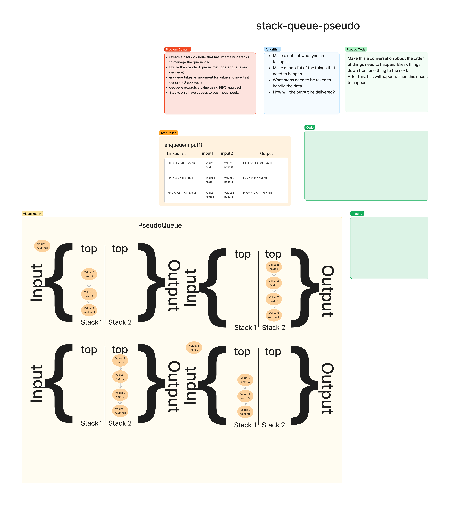

# Challenge Title
<!-- Description of the challenge -->
Code Challenge 05: Singly Linked Lists

Code Challenge 11: PsuedoQueue

## Whiteboard Process
<!-- Embedded whiteboard image -->

## Approach & Efficiency
<!-- What approach did you take? Why? What is the Big O space/time for this approach? -->

## Solution
<!-- Show how to run your code, and examples of it in action -->
